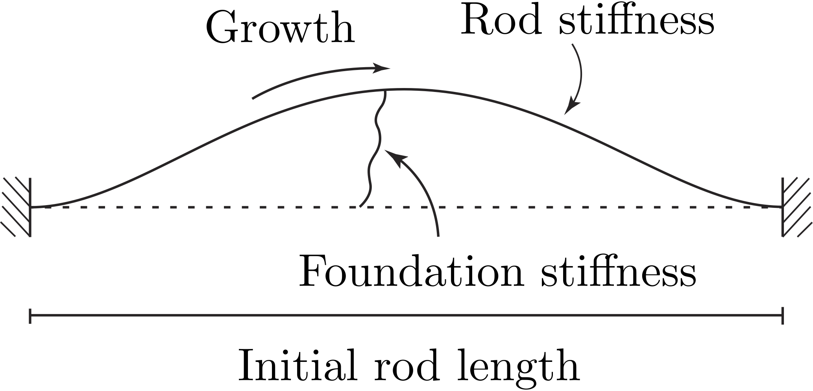
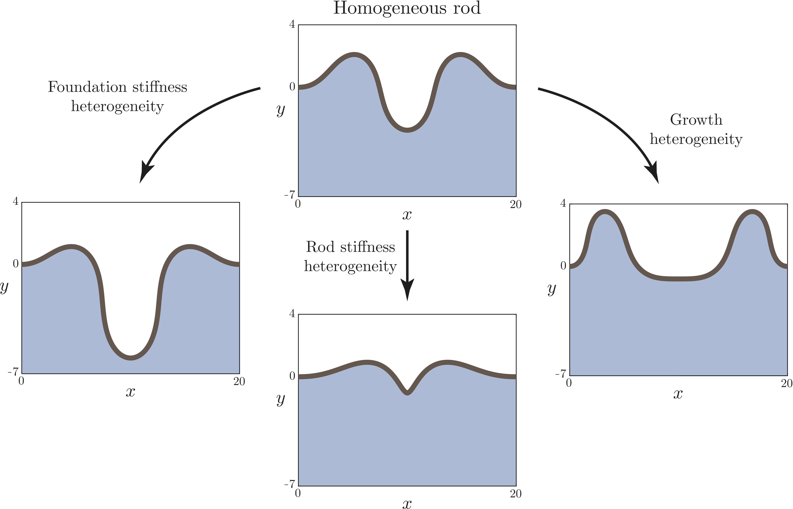
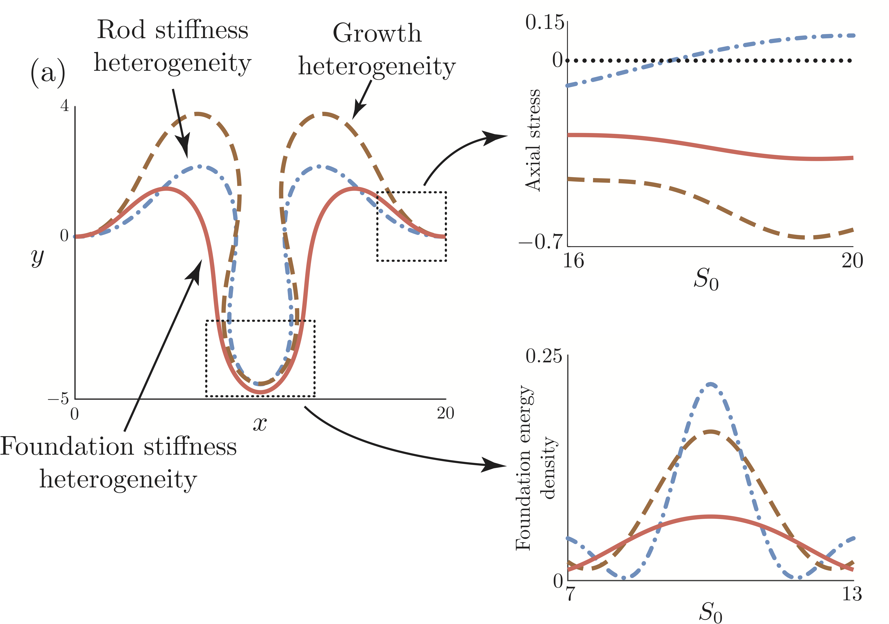

```{r setup, include=FALSE, warning=FALSE, message=FALSE}
knitr::opts_chunk$set(echo = TRUE)
library(ggplot2)
library(cowplot)
library(R.matlab)
library(latex2exp)
library(RColorBrewer)
library(ggpubr)
library(plotly)
```

## Current-set up
We consider the growth of an elastic rod tethered to an underlying foundation, that we specialise to that of a colonic crypt.

```{r, out.width = "500px", fig.align="center", echo=FALSE}

```

## Previously
Performed analysis on the effects of heterogeneity in different material properties on simplified version of model.

### The forward problem
```{r, out.width = "700px", fig.align="center", echo=FALSE}

```

### The inverse problem
```{r, out.width = "700px", fig.align="center", echo=FALSE}

```

## Current work

What is involved in the transition from 'crypt formation' to 'crypt maintenance'?

### Main assumptions

* Growth is tethered to Wnt, which is assumed to decrease from the base upwards (various sources)

* Stem cells in the base are assumed to be four times as soft as the differentiated cells at the top (Pin et al., 2015)

* The underlying stroma behaves viscoelastically (personal results).

* There is an intrinsic curvature of the epithelium, which relaxes over time (Tan et al., 2013)


## Some results
Both viscoelasticity and curvature relaxation introduce a 'timescale' to the system. Hence, what balance between the two is required for proper crypt formation?

When viscoelasticity and curvature relaxation are balanced with growth:

```{r plot crypt maxwell nu 0p16 eta 0p16 vid, echo=FALSE, fig.align="center", warning=FALSE}
directory = "~/Documents/MorphoelasticCrypt/MATLAB/Solutions/LinearViscoelasticFoundation/Maxwell/"
values = "Eb_0p75_sigmaE_2w_simplified_nu_0p16_k_0p02_L0_0p125_sigma_2w_etaK_0p16_initforce"

# Load the solutions
solsList <- readMat(paste(directory, "sols_", values, ".mat", sep=""))
# Load the times
timesList <- readMat(paste(directory, "times_", values, ".mat", sep=""))
stressesList <- readMat(paste(directory, "maxwellstresses_", values, ".mat", sep=""))

numSols <- length(solsList[[1]])
solData <- NULL # Create data frame for solutions
stressData <- NULL
curvData <- NULL

# Some parameters
solCount <- 1

# # Plot solutions
for ( i in seq(1, numSols, solCount) )
{
  # Extract the solution, growth and time
  sol <- solsList[[1]][[i]][[1]]
  currentTime = timesList[[1]][[i]]
  stresses <- stressesList[[1]][[i]][[1]]

  # Update the solutions
  solDataFrame <- data.frame(S=sol[2,], x=sol[3,], y=sol[4,], nX=sol[5,], nY=sol[6,], theta=sol[7,], m=sol[8,])
  solDataFrame$time = toString(currentTime)
  solData <- rbind(solData, solDataFrame)
}

solPlot <- ggplot(data=solData, aes(frame=time)) +
  geom_path(aes((15/(2*sqrt(3)))*x, -(15/(2*sqrt(3)))*y + 2*6*125, frame=time), size=0.75) + 
  ylab("y") + xlab("x") + 
  theme(legend.position="none", panel.background = element_blank(), axis.line = element_line(colour = "black"), panel.grid.major = element_blank(), panel.grid.minor = element_blank(), axis.ticks = element_blank(), text=element_text(size=18))

solPlot <- solPlot + geom_path(aes(125 - (15/(2*sqrt(3)))*x, -(15/(2*sqrt(3)))*y + 2*6*125, frame=time), size=0.75)

animatedPlot <- ggplotly(solPlot, frame = 0, transition = 0, redraw=FALSE)

animatedPlot
```


We can summarise the effects of these timescales (pretty) succinctly

```{r plot crypt maxwell init nu-etaK grid, echo=FALSE, fig.align="center", warning=FALSE}
directory = "~/Documents/MorphoelasticCrypt/MATLAB/Solutions/LinearViscoelasticFoundation/Maxwell/"
values = "Eb_0p75_sigmaE_2w_simplified_nu_16_k_0p02_L0_0p125_sigma_2w_etaK_0p16_initforce"

# Load the solutions
solsList <- readMat(paste(directory, "sols_", values, ".mat", sep=""))
# Load the times
timesList <- readMat(paste(directory, "times_", values, ".mat", sep=""))

numSols <- length(solsList[[1]])
solData <- NULL # Create data frame for solutions
solPointData <- NULL

# Some parameters
solCount <- 3
pointCount <- 10

sol <- solsList[[1]][[numSols]][[1]]
currentTime = timesList[[1]][[numSols]]

# Update the solutions
solDataFrame <- data.frame(S=sol[2,], x=sol[3,], y=sol[4,], nX=sol[5,], nY=sol[6,], theta=sol[7,], m=sol[8,])
solDataFrame$time = toString(currentTime)
solData <- rbind(solData, solDataFrame)

solPlot1 <- ggplot()
solPlot1 <- solPlot1 + geom_path(data=solData, aes((15/(2*sqrt(3)))*x, -(15/(2*sqrt(3)))*y + 6*2*125, color=time), size=1.0)  +  ylab(TeX('$y\\,(\\mu m)$')) +   xlab(TeX('$x\\, (\\mu m)$')) + 
            theme(legend.position="none", panel.background = element_blank(), axis.line = element_line(colour = "black"), panel.grid.major = element_blank(), panel.grid.minor = element_blank(), axis.ticks = element_blank(), text=element_text(size=18)) + 
            scale_x_continuous(expand = c(0, 0), limits=c(0,126))

values = "Eb_0p75_sigmaE_2w_simplified_nu_16_k_0p02_L0_0p125_sigma_2w_etaK_1p6_initforce"

# Load the solutions
solsList <- readMat(paste(directory, "sols_", values, ".mat", sep=""))
# Load the times
timesList <- readMat(paste(directory, "times_", values, ".mat", sep=""))

numSols <- length(solsList[[1]])
solData <- NULL # Create data frame for solutions

sol <- solsList[[1]][[numSols]][[1]]
currentTime = timesList[[1]][[numSols]]

# Update the solutions
solDataFrame <- data.frame(S=sol[2,], x=sol[3,], y=sol[4,], nX=sol[5,], nY=sol[6,], theta=sol[7,], m=sol[8,])
solDataFrame$time = toString(currentTime)
solData <- rbind(solData, solDataFrame)

solPlot2 <- ggplot()
solPlot2 <- solPlot2 + geom_path(data=solData, aes((15/(2*sqrt(3)))*x, -(15/(2*sqrt(3)))*y + 6*2*125, color=time), size=1.0)  +  ylab(TeX('$y\\,(\\mu m)$')) +   xlab(TeX('$x\\, (\\mu m)$')) + 
            theme(legend.position="none", panel.background = element_blank(), axis.line = element_line(colour = "black"), panel.grid.major = element_blank(), panel.grid.minor = element_blank(), axis.ticks = element_blank(), text=element_text(size=18)) + 
            scale_x_continuous(expand = c(0, 0), limits=c(0,126))

values = "Eb_0p75_sigmaE_2w_simplified_nu_16_k_0p02_L0_0p125_sigma_2w_etaK_16_initforce"

# Load the solutions
solsList <- readMat(paste(directory, "sols_", values, ".mat", sep=""))
# Load the times
timesList <- readMat(paste(directory, "times_", values, ".mat", sep=""))

numSols <- length(solsList[[1]])
solData <- NULL # Create data frame for solutions

sol <- solsList[[1]][[numSols]][[1]]
currentTime = timesList[[1]][[numSols]]

# Update the solutions
solDataFrame <- data.frame(S=sol[2,], x=sol[3,], y=sol[4,], nX=sol[5,], nY=sol[6,], theta=sol[7,], m=sol[8,])
solDataFrame$time = toString(currentTime)
solData <- rbind(solData, solDataFrame)

solPlot3 <- ggplot()
solPlot3 <- solPlot3 + geom_path(data=solData, aes((15/(2*sqrt(3)))*x, -(15/(2*sqrt(3)))*y + 6*2*125, color=time), size=1.0)  +  ylab(TeX('$y\\,(\\mu m)$')) +   xlab(TeX('$x\\, (\\mu m)$')) + 
            theme(legend.position="none", panel.background = element_blank(), axis.line = element_line(colour = "black"), panel.grid.major = element_blank(), panel.grid.minor = element_blank(), axis.ticks = element_blank(), text=element_text(size=18)) + 
            scale_x_continuous(expand = c(0, 0), limits=c(0,126))

values = "Eb_0p75_sigmaE_2w_simplified_nu_1p6_k_0p02_L0_0p125_sigma_2w_etaK_0p16_initforce"

# Load the solutions
solsList <- readMat(paste(directory, "sols_", values, ".mat", sep=""))
# Load the times
timesList <- readMat(paste(directory, "times_", values, ".mat", sep=""))

numSols <- length(solsList[[1]])
solData <- NULL # Create data frame for solutions
solPointData <- NULL

# Some parameters
solCount <- 3
pointCount <- 10

sol <- solsList[[1]][[numSols]][[1]]
currentTime = timesList[[1]][[numSols]]

# Update the solutions
solDataFrame <- data.frame(S=sol[2,], x=sol[3,], y=sol[4,], nX=sol[5,], nY=sol[6,], theta=sol[7,], m=sol[8,])
solDataFrame$time = toString(currentTime)
solData <- rbind(solData, solDataFrame)

solPlot4 <- ggplot()
solPlot4 <- solPlot4 + geom_path(data=solData, aes((15/(2*sqrt(3)))*x, -(15/(2*sqrt(3)))*y + 6*2*125, color=time), size=1.0)  +  ylab(TeX('$y\\,(\\mu m)$')) +   xlab(TeX('$x\\, (\\mu m)$')) + 
            theme(legend.position="none", panel.background = element_blank(), axis.line = element_line(colour = "black"), panel.grid.major = element_blank(), panel.grid.minor = element_blank(), axis.ticks = element_blank(), text=element_text(size=18)) + 
            scale_x_continuous(expand = c(0, 0), limits=c(0,126))

values = "Eb_0p75_sigmaE_2w_simplified_nu_1p6_k_0p02_L0_0p125_sigma_2w_etaK_1p6_initforce"

# Load the solutions
solsList <- readMat(paste(directory, "sols_", values, ".mat", sep=""))
# Load the times
timesList <- readMat(paste(directory, "times_", values, ".mat", sep=""))

numSols <- length(solsList[[1]])
solData <- NULL # Create data frame for solutions
solPointData <- NULL

# Some parameters
solCount <- 3
pointCount <- 10

sol <- solsList[[1]][[numSols]][[1]]
currentTime = timesList[[1]][[numSols]]

# Update the solutions
solDataFrame <- data.frame(S=sol[2,], x=sol[3,], y=sol[4,], nX=sol[5,], nY=sol[6,], theta=sol[7,], m=sol[8,])
solDataFrame$time = toString(currentTime)
solData <- rbind(solData, solDataFrame)

solPlot5 <- ggplot()
solPlot5 <- solPlot5 + geom_path(data=solData, aes((15/(2*sqrt(3)))*x, -(15/(2*sqrt(3)))*y + 6*2*125, color=time), size=1.0)  +  ylab(TeX('$y\\,(\\mu m)$')) +   xlab(TeX('$x\\, (\\mu m)$')) + 
            theme(legend.position="none", panel.background = element_blank(), axis.line = element_line(colour = "black"), panel.grid.major = element_blank(), panel.grid.minor = element_blank(), axis.ticks = element_blank(), text=element_text(size=18)) + 
            scale_x_continuous(expand = c(0, 0), limits=c(0,126))

values = "Eb_0p75_sigmaE_2w_simplified_nu_1p6_k_0p02_L0_0p125_sigma_2w_etaK_16_initforce"

# Load the solutions
solsList <- readMat(paste(directory, "sols_", values, ".mat", sep=""))
# Load the times
timesList <- readMat(paste(directory, "times_", values, ".mat", sep=""))

numSols <- length(solsList[[1]])
solData <- NULL # Create data frame for solutions
solPointData <- NULL

# Some parameters
solCount <- 3
pointCount <- 10

sol <- solsList[[1]][[numSols]][[1]]
currentTime = timesList[[1]][[numSols]]

# Update the solutions
solDataFrame <- data.frame(S=sol[2,], x=sol[3,], y=sol[4,], nX=sol[5,], nY=sol[6,], theta=sol[7,], m=sol[8,])
solDataFrame$time = toString(currentTime)
solData <- rbind(solData, solDataFrame)

solPlot6 <- ggplot()
solPlot6 <- solPlot6 + geom_path(data=solData, aes((15/(2*sqrt(3)))*x, -(15/(2*sqrt(3)))*y + 6*2*125, color=time), size=1.0)  +  ylab(TeX('$y\\,(\\mu m)$')) +   xlab(TeX('$x\\, (\\mu m)$')) + 
            theme(legend.position="none", panel.background = element_blank(), axis.line = element_line(colour = "black"), panel.grid.major = element_blank(), panel.grid.minor = element_blank(), axis.ticks = element_blank(), text=element_text(size=18)) + 
            scale_x_continuous(expand = c(0, 0), limits=c(0,126))

values = "Eb_0p75_sigmaE_2w_simplified_nu_0p16_k_0p02_L0_0p125_sigma_2w_etaK_0p16_initforce"

# Load the solutions
solsList <- readMat(paste(directory, "sols_", values, ".mat", sep=""))
# Load the times
timesList <- readMat(paste(directory, "times_", values, ".mat", sep=""))

numSols <- length(solsList[[1]])
solData <- NULL # Create data frame for solutions
solPointData <- NULL

# Some parameters
solCount <- 3
pointCount <- 10

sol <- solsList[[1]][[numSols]][[1]]
currentTime = timesList[[1]][[numSols]]

# Update the solutions
solDataFrame <- data.frame(S=sol[2,], x=sol[3,], y=sol[4,], nX=sol[5,], nY=sol[6,], theta=sol[7,], m=sol[8,])
solDataFrame$time = toString(currentTime)
solData <- rbind(solData, solDataFrame)

solPlot7 <- ggplot()
solPlot7 <- solPlot7 + geom_path(data=solData, aes((15/(2*sqrt(3)))*x, -(15/(2*sqrt(3)))*y + 6*2*125, color=time), size=1.0)  +  ylab(TeX('$y\\,(\\mu m)$')) +   xlab(TeX('$x\\, (\\mu m)$')) + 
            theme(legend.position="none", panel.background = element_blank(), axis.line = element_line(colour = "black"), panel.grid.major = element_blank(), panel.grid.minor = element_blank(), axis.ticks = element_blank(), text=element_text(size=18)) + 
            scale_x_continuous(expand = c(0, 0), limits=c(0,126))

values = "Eb_0p75_sigmaE_2w_simplified_nu_0p16_k_0p02_L0_0p125_sigma_2w_etaK_1p6_initforce"

# Load the solutions
solsList <- readMat(paste(directory, "sols_", values, ".mat", sep=""))
# Load the times
timesList <- readMat(paste(directory, "times_", values, ".mat", sep=""))

numSols <- length(solsList[[1]])
solData <- NULL # Create data frame for solutions
solPointData <- NULL

# Some parameters
solCount <- 3
pointCount <- 10

sol <- solsList[[1]][[numSols]][[1]]
currentTime = timesList[[1]][[numSols]]

# Update the solutions
solDataFrame <- data.frame(S=sol[2,], x=sol[3,], y=sol[4,], nX=sol[5,], nY=sol[6,], theta=sol[7,], m=sol[8,])
solDataFrame$time = toString(currentTime)
solData <- rbind(solData, solDataFrame)

solPlot8 <- ggplot()
solPlot8 <- solPlot8 + geom_path(data=solData, aes((15/(2*sqrt(3)))*x, -(15/(2*sqrt(3)))*y + 6*2*125, color=time), size=1.0)  +  ylab(TeX('$y\\,(\\mu m)$')) +   xlab(TeX('$x\\, (\\mu m)$')) + 
            theme(legend.position="none", panel.background = element_blank(), axis.line = element_line(colour = "black"), panel.grid.major = element_blank(), panel.grid.minor = element_blank(), axis.ticks = element_blank(), text=element_text(size=18)) + 
            scale_x_continuous(expand = c(0, 0), limits=c(0,126))

values = "Eb_0p75_sigmaE_2w_simplified_nu_0p16_k_0p02_L0_0p125_sigma_2w_etaK_16_initforce"

# Load the solutions
solsList <- readMat(paste(directory, "sols_", values, ".mat", sep=""))
# Load the times
timesList <- readMat(paste(directory, "times_", values, ".mat", sep=""))

numSols <- length(solsList[[1]])
solData <- NULL # Create data frame for solutions
solPointData <- NULL

# Some parameters
solCount <- 3
pointCount <- 10

sol <- solsList[[1]][[numSols]][[1]]
currentTime = timesList[[1]][[numSols]]

# Update the solutions
solDataFrame <- data.frame(S=sol[2,], x=sol[3,], y=sol[4,], nX=sol[5,], nY=sol[6,], theta=sol[7,], m=sol[8,])
solDataFrame$time = toString(currentTime)
solData <- rbind(solData, solDataFrame)

solPlot9 <- ggplot()
solPlot9 <- solPlot9 + geom_path(data=solData, aes((15/(2*sqrt(3)))*x, -(15/(2*sqrt(3)))*y + 6*2*125, color=time), size=1.0)  +  ylab(TeX('$y\\,(\\mu m)$')) +   xlab(TeX('$x\\, (\\mu m)$')) + 
            theme(legend.position="none", panel.background = element_blank(), axis.line = element_line(colour = "black"), panel.grid.major = element_blank(), panel.grid.minor = element_blank(), axis.ticks = element_blank(), text=element_text(size=18)) + 
            scale_x_continuous(expand = c(0, 0), limits=c(0,126))
  
ggarrange(solPlot1, solPlot2, solPlot3, solPlot4, solPlot5, solPlot6, solPlot7, solPlot8, solPlot9, ncol=3, nrow=3)
```


## Future directions
* What causes the transition from 'crypt formation' to 'crypt maintenance'?

* Self-contact in the crypt appears to be necessary for proper formation

* Growth should evolve to a steady state that depends on mechanical stresses.
